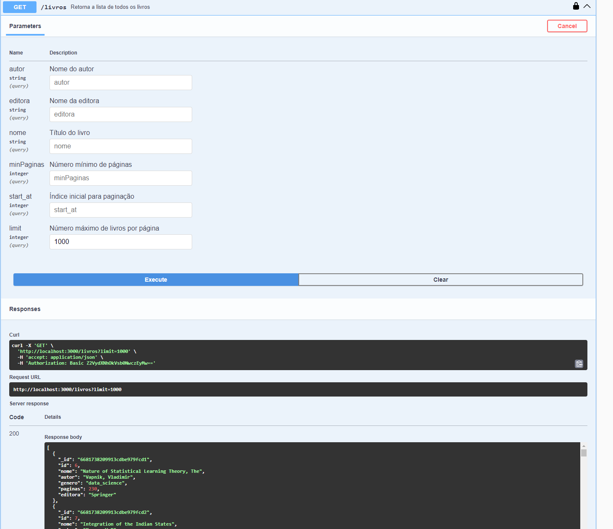

# Projeto de API - Crud de Livros

Usando NodeJS+express e MongoDB
Documentação via Swagger, Autenticação Basic e Padrão MVC

## Parâmetros:

Url de Acesso à Documentação: http://sol.librian.info:3000/api-docs/

Url da API: http://sol.librian.info:3000/livros/

## 

Para acesso via Postman ou curl:

​	Autenticação: Basic

​	Hearders:

​		Accept: application/json

​		Content-Type: application/json

## Endpoints:

### GET /livros

Esse endpoint gera uma lista de livros de forma paginada usando start_At e limit.

Por padrão o startAt é 0 e o limit é 1000.

GET http://localhost:3000/livros/

Com esse comando temos os primeiros 1000 livros.

Para pegar a próxima página, usar o startAt com 1001.

Esse endpoint também permite o filtro dos dados através de Nome, Autor, Genero e Editora do Livro, e pela quantidade mínima de páginas.

Parâmetros: autor, editora, genero, nome, minPaginas, start_at, limit

Para incluir o filtro, incluir um ? após o livros e incluir os filtros com & entre as condições (and)

GET http://localhost:3000/livros?editora=OrionBooks&minPaginas=200
