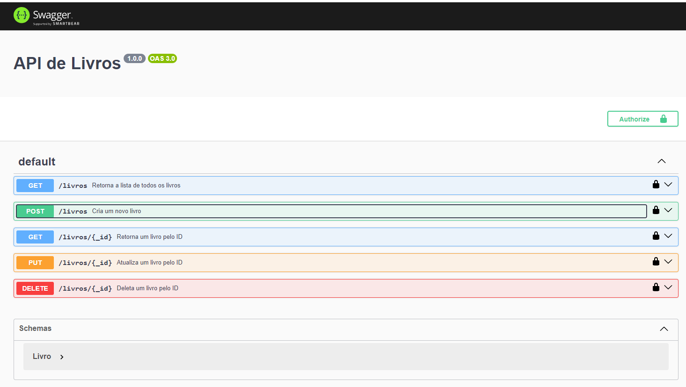
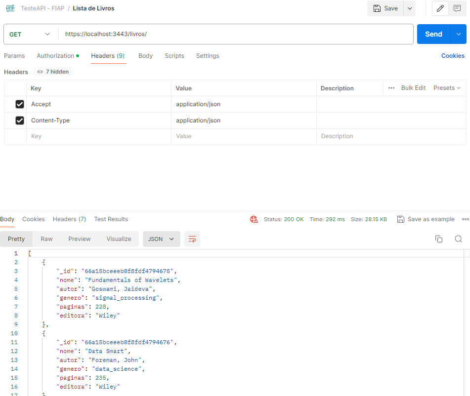
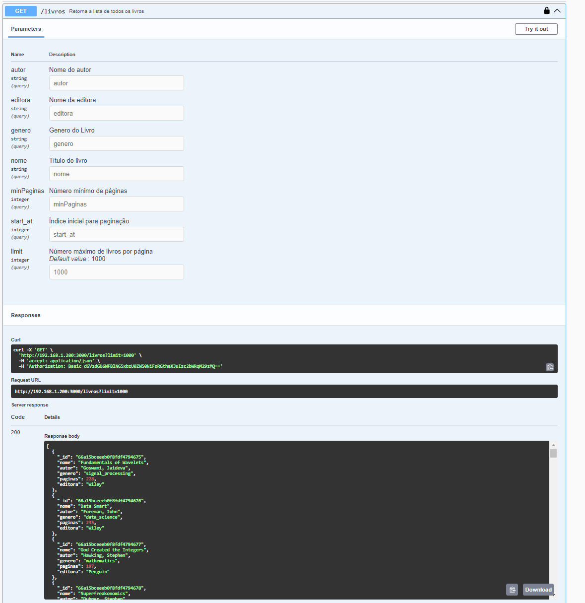
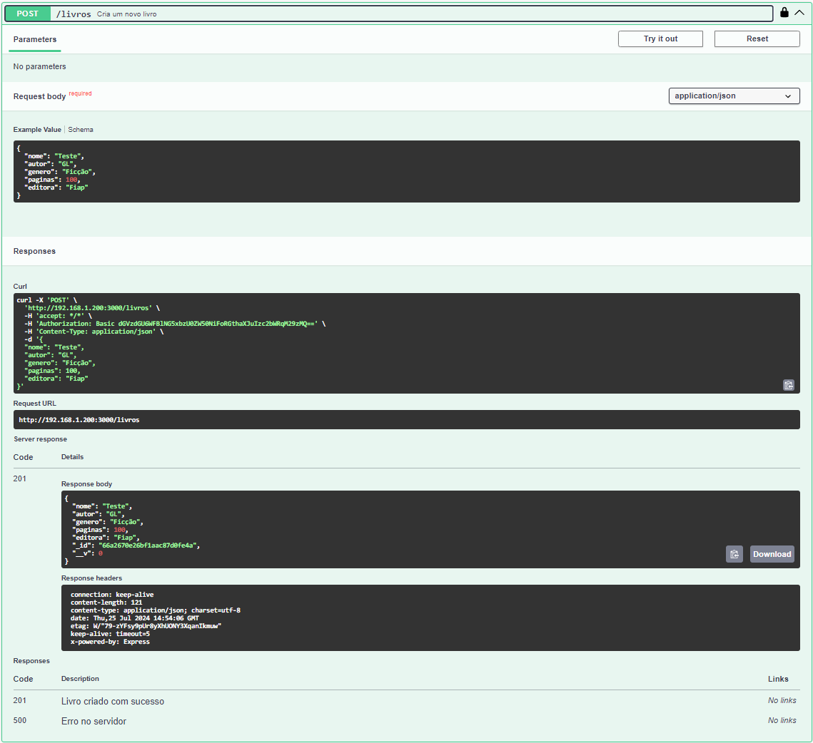
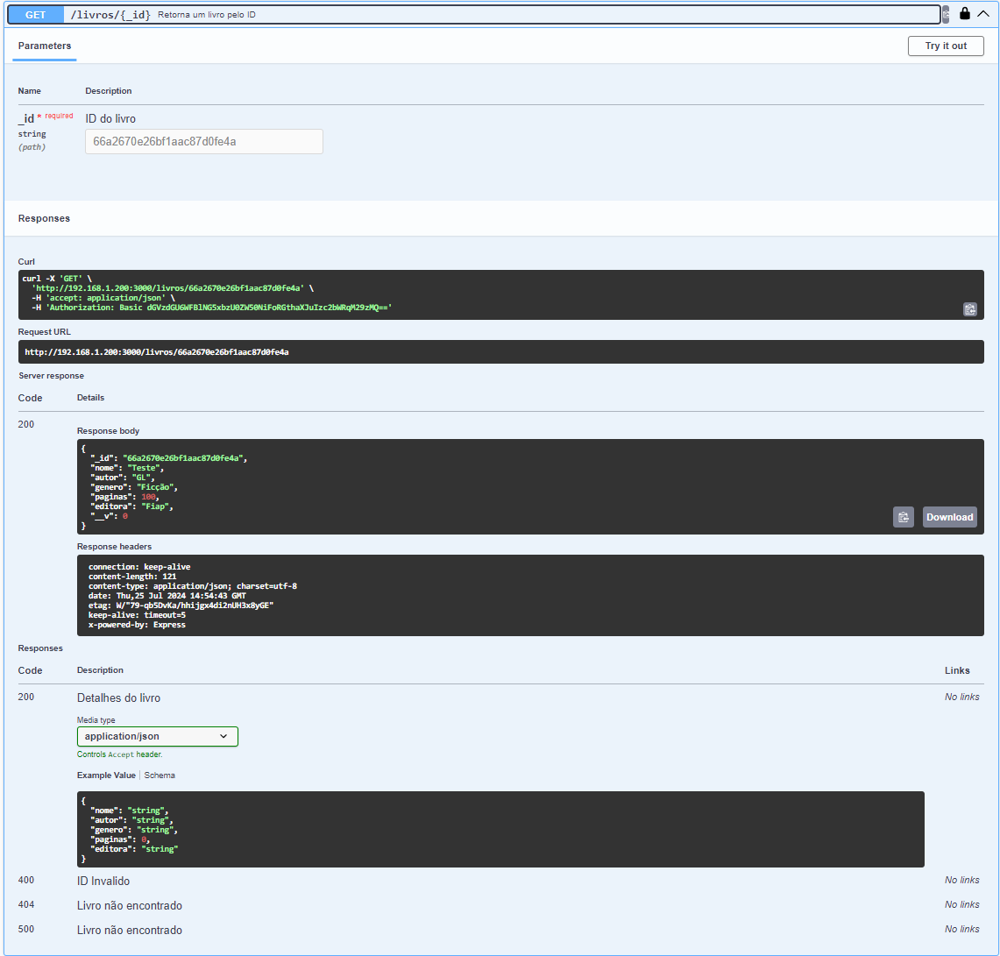
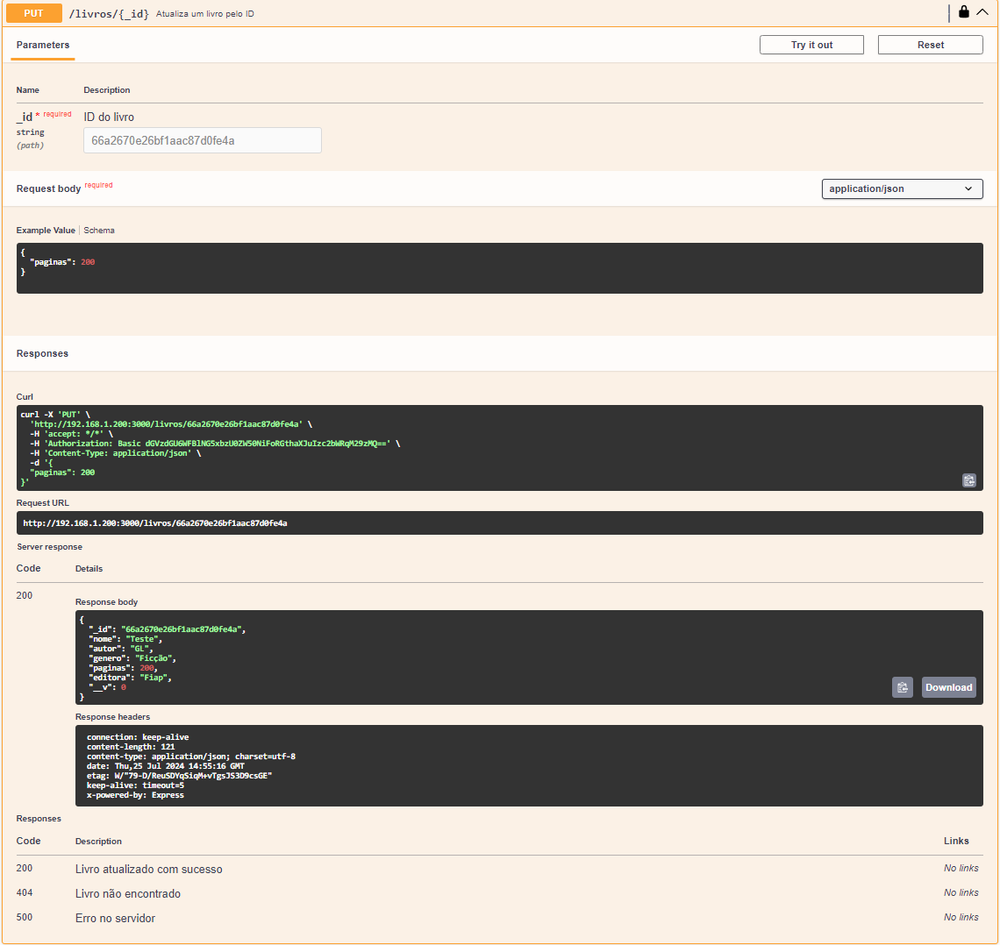
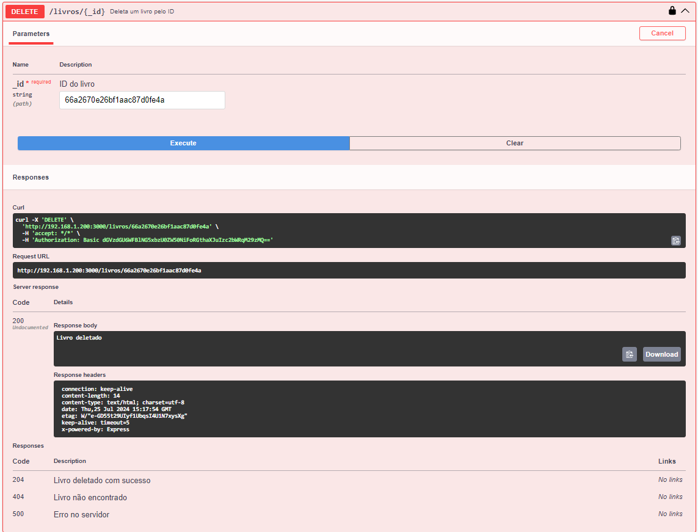
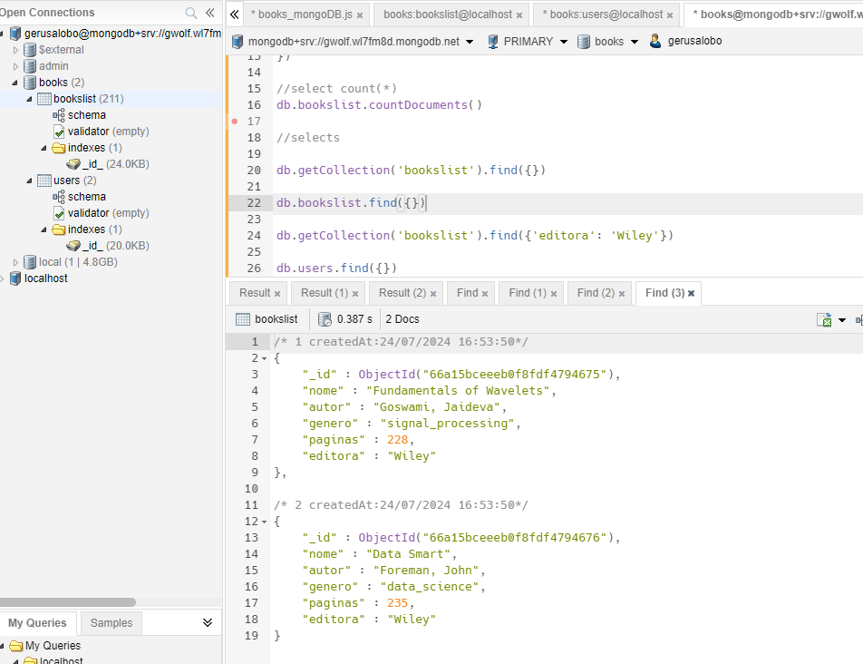
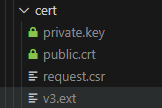

# CRUD API de Livros

Este projeto é uma API RESTful para gerenciar um catálogo de livros, usando Node.js, Express, MongoDB e Mongoose. A API permite realizar operações CRUD (Create, Read, Update, Delete) para gerenciar informações sobre livros, como nome, autor, gênero, número de páginas e editora.

Documentação via Swagger, Autenticação Basic e Padrão MVC.


## URL's de Acesso

A API está ativa como um serviço em um servidor linux Mint local com o MongoDB no Atlas.

Url de Acesso à Documentação: 

http://sol.librian.info:3000/api-docs/

https://sol.librian.info:3443/api-docs/

Url da API: 

http://sol.librian.info:3000/livros/

http://sol.librian.info:3443/livros/




Observação: é preciso aceitar a conexão em https, porque a entidade certificadora do certificado que foi criado, é de teste e não pública.


## Conexão

1. **Acesso via Swagger**:

    http://sol.librian.info:3000/api-docs/
    https://sol.librian.info:3443/api-docs/


2. **Acesso via Postman ou Curl**:

   Para acesso via Postman ou curl, usar:

    - Autenticação: Basic
    - Hearders:
       - Accept: application/json
       - Content-Type: application/json





## Autenticação

A API utiliza autenticação básica através do middleware `auth.js`. Para acessar os endpoints protegidos, é necessário fornecer um nome de usuário e senha.


## Estrutura do Projeto

- `app.js`: Arquivo principal do aplicativo, responsável por configurar e iniciar o servidor, conectar-se ao MongoDB, configurar middlewares e rotas, e integrar a documentação Swagger.
- `controllers/`: Diretório que contém os controladores (controllers) da API, responsáveis pela lógica de negócios e manipulação de dados. No caso, o `livroController.js` contém as funções para operações CRUD.
- `middlewares/`: Diretório que contém middlewares de autenticação e validação, como `auth.js` para autenticação básica e `validateAndSanitize.js` para validar e sanitizar as entradas de dados.
- `models/`: Diretório que contém os modelos Mongoose, definindo a estrutura dos documentos no MongoDB. O `Livro.js` define o esquema do documento de livro.
- `routes/`: Diretório que contém as definições de rotas da API. O `livroRoutes.js` define as rotas para operações CRUD nos livros, associando cada rota a uma função do controlador.
- `swagger/`: Configuração e documentação da API usando Swagger, permitindo a visualização e interação com os endpoints da API.


Observação: As variáveis de ambiente como a URL para conexão com o banco foram registradas em um arquivo oculto .env.

A pasta de certificados foi colocada no gitignore, assim como o arquivo .env.


Maiores detalhes sobre o projeto no [Readme.md](./Crud_MongoDB/readme.md)


## Endpoints:

### GET /livros



Esse endpoint obtém a lista de livros de forma paginada usando start_at e limit.

Por padrão o start_at é 0 e o limit é 1000.

GET http://localhost:3000/livros/

Com esse comando temos os primeiros 1000 livros.

Para pegar a próxima página, usar o start_at com 1001.


Esse endpoint também permite o filtro dos dados através de Nome, Autor, Genero e Editora do Livro, e pela quantidade mínima de páginas.

Parâmetros: autor, editora, genero, nome, minPaginas

Para incluir o filtro, incluir um ? após o livros e incluir os filtros com & entre as condições (and)

GET http://localhost:3000/livros?editora=Wileys&minPaginas=200


### POST /livros/

Esse endpoint permite a criação de um livro:



Usando um json no body com os parâmetros: nome, autor, gênero, páginas e editora.

```json
{
  "nome": "Teste",
  "autor": "GL",
  "genero": "Ficção",
  "paginas": 100,
  "editora": "Fiap"
}
```


### GET /livros/:id

Esse endpoint pega os dados de um livro, pelo Id do livro.




Esse endpoint trás os dados detalhados do livro, enviando o parâmetro do Id.

### PUT /livros/:id

Esse endpoint permite a alteração do livro, usando o _Id de parâmetro para indicar o livro, e o os dados alterados no body.




Usando um json no body com a propriedade a ser alterada:

```json
{
  "paginas": 200
}
```


### DELETE /livros/:id

Esse endpoint permite que um livro seja deletado.




## Configuração e Uso

1. **Instalar dependências**:

   ```
   bash
   Copiar código
   npm install
   ```

2. **Configurar o MongoDB**:

   No arquivo `app.js`, configure a conexão com o MongoDB Atlas ou outro servidor MongoDB de sua preferência.

   - No código `app.js`  a conexão com banco local está comentada.

   - Para a conexão com o banco no Atlas, criar o arquivo .env e inserir: MONGODB_URI ="url_de_conexão_do_Atlas"

   

   O arquivo `bookslist.csv`, tem a base de dados de livros importada no MongoDB para teste.

   

   Para o projeto foi usado o banco books e as collections: users e bookslist.

   

   

3. **Executar o servidor**:

   ```
   bash
   Copiar código
   node app.js
   ```

4. **Acessar a documentação da API**:

   A documentação da API gerada pelo Swagger estará disponível em `http://localhost:3000/api-docs` 

   

5. **Acesso via https**:

   Para ter as urls em https da documentação e do servidor, é necessário incluir uma pasta cert dentro da pasta de Crud_MongoDB com os dados dos certificados.



Caso você não tenha como gerar um certificado, favor comentar os trechos de códigos abaixo, no arquivo app.js:

```
https.createServer(httpsoptions, app).listen(HTTPSPORT, () => {
  console.log(`Servidor HTTPS escutando na porta ${HTTPSPORT}`);
  console.log(`Swagger UI disponível em https://localhost:${HTTPSPORT}/api-docs`);
});
```

```
var httpsoptions = {
  key: fs.readFileSync(process.env.API_KEY || './cert/private.key'),
  cert: fs.readFileSync(process.env.API_CRT || './cert/public.crt')
};
```


## Ambientes Utilizados no Desenvolvimento

- O desenvolvimento foi realizado usando o  VSCode em máquina Windows 11 com MongoDB local.

  

- O software foi implantado em produção em um servidor linux Mint local conectado ao MongoDB no Atlas, e a aplicação ativada como serviço.


